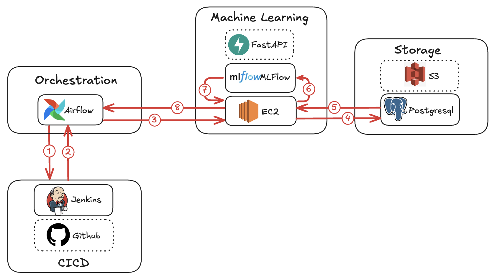

# Est'Immo 🏠

## Context

[Est'Immo](https://qxzjy-streamlit-housing-prices.hf.space/) is an app designed to help professionals and individuals estimate the value of a property by leveraging historical transaction data and machine learning.

In a tight market, it is important to sell at the right price:
- too low : the seller loses money.
- too high : the property does not sell.

## Architecture


This application integrates several tools and services to handle orchestration, model management, storage, API exposure, user interface, and CI/CD.

### Orchestration, model management & computing
- **Airflow** manages and orchestrates the application workflows, from data ingestion to model deployment.
- **MLflow** is used for model tracking, storage, versioning, and serving models for predictions.
- **Amazon EC2** is used as a remote compute environment for training machine learning models, providing the necessary resources for heavy computation.

### Storage
- **Amazon S3** stores raw data and intermediate artifacts, offering scalable and durable object storage.
- **PostgreSQL** is the primary relational database with two schemas:
  - `housing_prices` the real estate estimator database.
  - `mlflow` is used by MLflow to store experiments, runs, parameters, metrics, and model artifacts.

### API & User Interface
- **FastAPI** provides a RESTful API to expose the model and application logic.
- **Streamlit** delivers a user-friendly web interface to visualize database content and model results.

### CI/CD and Testing
- **GitHub** is used for source code management, version control, and team collaboration.
- **Jenkins** automates CI/CD workflows including testing, building, and deployment of the application.
- **Evidently** detecting data drift and generating alerts on anomalies.

### Deployment
- **HuggingFace spaces** hosts MLflow, FastAPI, and Streamlit.
- **NeonDB** serves as the managed PostgreSQL database.
- **Docker** is used for running local instances of Airflow and Jenkins.
- **Ngrok** creates secure tunnels to expose local services online.

**Note** : Free services are prioritized.

## Worfklows

### Prediction

Runs whenever a user requests a price estimation in the Streamlit app. The user enters property details, which are sent to a FastAPI service. FastAPI queries the deployed model in MLflow to generate the prediction. The predicted price is immediately shown back to the user in Streamlit. Both the property details and the prediction result are then saved into the PostgreSQL database for tracking and future analysis.

### Data drift detection (DAG)

Runs on a schedule (e.g., daily). The pipeline extracts both recent and historical property data from the PostgreSQL database. Using Evidently, it monitors for data drift by checking feature distributions and target stability :
- no drift detected : the workflow ends.
- drift detected : a notification is sent to the data team with the link to the Evidently report, and the model training process is triggered to update the prediction model.

### Model training (DAG)

Runs whenever a data drift is detected or if requested by the data team. The status of the last Jenkins task executed is retrieved. This task runs every time there is an update to the GitHub repository of the machine learning model, in order to automatically run unit tests. If the task is OK, an EC2 instance will be created in order to connect to it via SSH and launch a new model training. Training is carried out using data retrieved from PostgreSQL and relying on MFlow for execution and then storage of the model. The EC2 instance is then deleted for both energy and cost savings.

## Demonstration

[Est'immo demo 🎞️](https://share.vidyard.com/watch/k65E1g7K34f9nWBrEE6zjF) (french only)

## Sources

[ML model and CI/CD pipeline](https://github.com/qxzjy/housing-prices-ml/) (Repository)

## Web pages

[Web dashboard](https://qxzjy-streamlit-housing-prices.hf.space/) (Streamlit)\
[Fraud detection API](https://qxzjy-fastapi-housing-prices.hf.space/docs) (FastAPI) \
[ML Server](https://qxzjy-mlflow-server.hf.space/#/experiments/10) (MLFlow)

## Getting Started (development environment)

1. Clone the repository

```bash
https://github.com/qxzjy/housing-prices.git

cd housing-prices
```

2. Init and launch Airflow 

```bash
cd airflow

docker-compose up airflow-init

docker-compose up
```

4. Open another terminal

```bash
cd <path_to_your_workspace>/housing-prices
```

4. Launch Jenkins Docker in Docker

```bash
cd jenkins

docker run -d --name jenkins-docker --rm \
  --privileged --network jenkins --network-alias docker \
  --env DOCKER_TLS_CERTDIR=/certs \
  --volume jenkins-docker-certs:/certs/client \
  --volume jenkins-data:/var/jenkins_home \
  --publish 2376:2376 \
  docker:dind --storage-driver overlay2
```

4. Build the Jenkins image

```bash
docker build -t myjenkins-blueocean:2.504.2-1 .
```

4. Launch Jenkins

```bash
docker run -d --name jenkins-blueocean --restart=on-failure \
  --network jenkins --env DOCKER_HOST=tcp://docker:2376 \
  --env DOCKER_CERT_PATH=/certs/client --env DOCKER_TLS_VERIFY=1 \
  --publish 8090:8080 --publish 50000:50000 \
  --volume jenkins-data:/var/jenkins_home \
  --volume jenkins-docker-certs:/certs/client:ro \
  myjenkins-blueocean:2.504.2-1
```

4. Map NGrock domain to local Jenkins

```bash
ngrok http --url=teal-destined-seemingly.ngrok-free.app localhost:8090
```

## Author

[Maxime RENAULT](https://github.com/qxzjy)